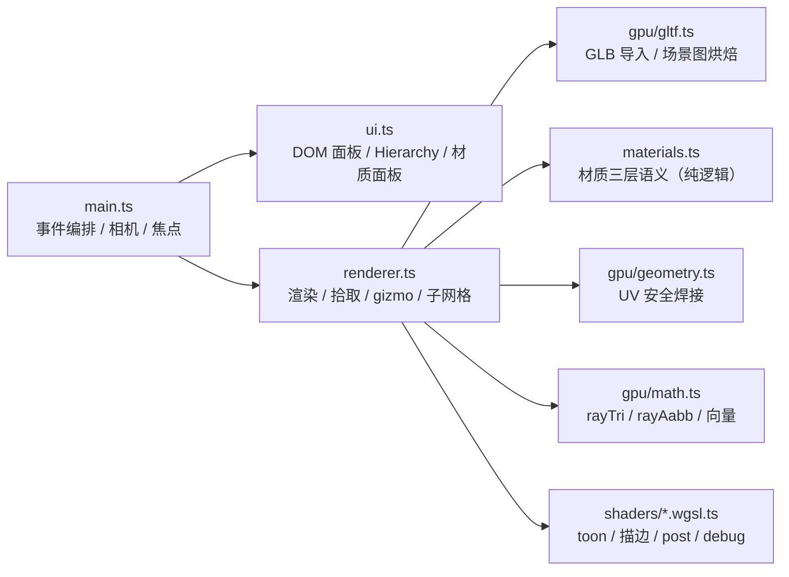

# 09 · Game Editor 核心技术沉淀（WebGPU 编辑器）

> 源项目：末日尸潮 · Game Editor（前身 Shader Lab），`apps/lab/shader-lab`
> 技术栈：TypeScript + 原生 WebGPU（不依赖 three.js）+ Vite；UI 用原生 DOM 直改，刻意不把交互热路径接进框架状态树。
> 标注 **【refine】** 的技术点 = 2026-09-01 代码审计轮（对标混元 Preview 4 水准）复核修正过的内容，附缺陷根因——低档模型产出被逐模块复核后留下的可复用结论。

---

## 0. 模块地图

---

## 1. 渲染架构（原生 WebGPU）

- 双 pass：场景 pass（opaque → inverted-hull 描边）+ post pass（toon 分阶 / 半调网点 / debug 视图 1..8）。
- uniform 槽位布局：`frame / lights / toon / material / transform` 各占独立区间；**材质按子网格分槽（上限 256），变换按物体分槽（上限 64）**。材质偏移 = `(slotBase+subIndex)*SLOT_BYTES`，变换偏移 = `objIndex*SLOT_BYTES`。
- bind group 按子网格组织为二维数组 `[objIndex][subIndex]`；**换模型只重建 bind group，不重建 buffer**。
- 绘制粒度到子网格：`drawIndexed(count, 1, indexStart)` —— 选中/悬停某条 mesh 只描该段轮廓。
- **【refine·严重】GPU 资源生命周期**：高亮 bind group 缓存了 texture view；换贴图 `destroy()` 旧纹理时**必须**选中/悬停两个 bind group 一起重建（`refreshHighlightBindGroups()`），否则渲染引用已销毁资源（WebGPU 校验错误/渲染垃圾）。
- **【refine】热路径零堆分配**：对 `render()` 与指针/帧循环逐行扫描，`new Float32Array` 全部收敛在构造期；gizmo 颜色走 scratch 复用；`canvasRect()` 按帧缓存（帧序号失效）供 `worldToScreen` / `pointerRay` 共用 —— hover 不再每次鼠标移动触发上百次 `getBoundingClientRect`。
- **【refine】贴图解码 `decodeTexture()`**：
  - 显式 `colorSpaceConversion: 'none'`（渲染器约定 albedo 传 raw sRGB、着色器内自转线性；浏览器色彩管理会把已偏暗的 baseColor 二次压暗）；
  - 长边 > 2048 用 OffscreenCanvas 降采样（4096² 直吃 67MB 显存），原图 `close()` 释放；
  - 解码失败在信息行显式报「⚠ 贴图解码失败」，与「无贴图平色预览」区分——之前用户看到的是"贴图丢了"却无任何提示。

## 2. 拾取（Picking）

- **数学**：Möller–Trumbore。**【refine】历史缺陷**：`q = tvec × edge2`（应为 `edge1`），v 恒错、拾取全落空——拾取功能上线以来从未真正工作过。由 `math.test.ts` 基准用例（t=5, u=0.25, v=0.5）把守。
- **宽相**：`rayAabb()`（slab 法，正确处理射线平行于面、起点在盒内、盒子在背后三种退化）+ `localMin/localMax` 包围盒缓存（仅网格替换时重算）。80k 面模型未命中判定 4ms → 亚毫秒【refine】。
- **窄相**：逐三角形精确求交而非 AABB 近似 —— 凹面物体不存在"AABB 虚胖吞掉盒内小物体"的经典嵌套问题。
- **嵌套/遮挡**：Alt+点击沿射线深度循环穿透（`pickAtClient(..., penetrate)`），逐层换选。
- **transform vs navigation 冲突消解**：gizmo 命中判定放在**鼠标按键门控之后**（右/中键/Shift 专用于视角导航），gizmo 用**屏幕空间**命中（12px 阈值 + `worldToScreen`）而非 3D 距离——远处小物体 3D 距离阈值必然失真。

## 3. 变换与 gizmo

- 旋转**单一真源是四元数**（`SceneObject.quat`），面板欧拉角仅作显示；面板滑块改欧拉 → 重建 quat，gizmo 改 quat → 回写欧拉，双向闭环。
- gizmo 拖拽用**累计角**（wrapAngle 累加 Δ）而非每帧重算 atan2 —— 角度跨 ±180° 时不再跳变。
- 单位契约：`setObjectRotDeg()` 收度、内部存弧度，命名即契约【refine】；缩放下限 `max(0.01, v)` 防 0 缩放产生不可逆退化矩阵。
- 已知取舍：±90° 万向锁附近欧拉显示会跳一次（姿态不变）。彻底消除需"等价欧拉解取与上次显示最接近的一组"，留作后续项。

## 4. glTF 导入管线

- **【refine·严重】场景图变换烘焙**：旧导入器把「忽略 node 层级变换」写进文档当已知限制——Blender 导出把 Z-up→Y-up 的 90° X 旋转烘在 node 上，导入必散架（Windows 3D Viewer 正常）。修正：
  - `collectMeshInstances()` 从 `scenes[0]` 递归累乘世界矩阵，同一 mesh 被多 node 引用 → 多实例；
  - `nodeMatrix()` 优先 `matrix`，否则按 glTF 规定 T·R·S 合成；
  - 法线用 **3×3 逆转置**（非等比缩放不歪），变换后归一化；
  - 先烘焙 node 变换，再做 Z-up 启发式检测 —— 两把尺子不重复生效。
- **【refine】accessor 归一化**：规范优先（仅 `normalized === true` 才归一）+ 数据兜底（整数分量实测 |v|>1 视为导出器漏标 normalized）。
- **【refine】smoothNormals 焊接键**：整数哈希在 56k 顶点下碰撞率约三成，撞上就把两个不相干顶点法线平均 → 描边外扩炸尖刺（"模型稀碎"的帮凶）。改为量化坐标字符串精确键（零碰撞）；后续大模型可改"数值哈希 + 桶内坐标校验"两级键。
- **【refine】两趟式合并**：先按 primitive 收集（类型化数组），再按总顶点数一次性预分配 `Float32Array.set()` —— 消除逐顶点 `push` 的百万次扩容拷贝。
- **【refine·行业规范】UV 安全焊接**：焊接键必须含 UV —— `(qx, qy, qz, qu, qv)`（UV 量化 1e-6）。**位置相同但 UV 不同 = UV 岛接缝点，绝不合并**；仅按位置焊接是教科书级"合并点破坏 UV"反模式（用户对比 Windows 3D Viewer 精准定位）。5 条回归测试把守（含镜像点不合并）。
- **primitive merge + SubMeshRange**：合并时记录每段 `name / indexStart / indexCount`，多 primitive 模型拆出多材质槽；primitive 命名 `mesh.name ?? material.name ?? primitive_N`。
- **【refine·单一真源】身高归一化**：三档 LOD 实测身高 2.0500 / 2.1076 / 2.1872，而 roster 真源 2.05（切换 LOD 角色长高 6.7%）。修正：`CHARACTER_HEIGHT_M` 常量（真源 roster.json）+ 纯函数 `normalizeMeshHeight()`（等比、脚底归零、幂等、不改入参），内置档与 GLB 导入同走一把尺子；LOD 漂移直接挂测试。
- 范围取舍：不支持外部 .bin / 外部纹理（只支持 glb 内嵌）——AI 生成管线够用，有意保持。

## 5. 材质系统（三层语义，对齐 Unity）

- **shared**（共享材质，改它=全局改，所有引用 mesh 同步）/ **instance**（从某材质克隆进库，可跨 mesh 复用、随 JSON 导出，改它不影响来源）/ **override**（挂在单条子网格上的局部副本）。优先级 **override > instance > shared**。
- **数据隔离铁律**：在共享材质上调参自动转 override —— 改动只作用于该 mesh，共享材质与其他引用它的 mesh 不受影响。「保存覆盖」= 把 override 提升为 instance 进库复用。
- 核心结构 `MaterialSlot { materialId, override }`：materialId 指向材质库，override 是槽位局部副本，互不干扰。
- 纯逻辑全部在 `materials.ts`（不碰 GPU/DOM，可独立单测，12 例）；共享条目**不**存库副本，一律按 id 回查 params —— 避免两份真源打架。
- 渲染侧：材质 uniform 按子网格分槽；换材质只重建对应 bind group。

## 6. Hierarchy 与编辑器 UI

- 层级树：对象节点可展开**子 mesh 节点**；子 mesh 独立显隐，右侧材质徽章三色（shared / instance / override）；GLB 的 primitive 区间真正接进 `setCharacter()`，多 primitive 模型拆出多个 mesh 节点。
- **hover 高亮零框架巡检**：层级 hover 直接改 renderer 状态 + 渲染帧比对生效，不进框架状态树、不触发场景巡检/循环渲染。
- 相机焦点：双击 / F 聚焦选中物体（`getObjectBounds()` 走 AABB 缓存，不再逐顶点遍历）；无选中回默认取景（`DEFAULT_VIEW` 单一常量，此前 0.95/9 两处硬编码改一处漏一处【refine】）。
- 相机导航魔数全部提为具名常量（`ORBIT_RAD_PER_PX / PITCH_DEG_PER_PX / PITCH_LIMIT_DEG / PAN_LIMIT_XZ / PAN_MIN_Y / PAN_MAX_Y`）【refine】。
- 死代码纪律：重构残留（`objectBoundsLegacy`、自赋值死代码）直接删除，不留"留档对照"【refine】。

## 7. 验证体系（无 GPU 验证方法论）

**验证分层，不用一把尺子**：数学结论走 Node 直测真实模块（无 GPU）；像素级观感判定走**带界面 Chrome + CDP（真实 GPU）**；自动化功能断言可走 **headless Chrome + SwiftShader WebGPU**（真实渲染管线 + 软件适配器）。早期「本环境 headless 跑不了 WebGPU」是**假阴性**（复用旧 profile / 缺 `--enable-unsafe-swiftshader`），已实证推翻——Chrome 152 可用配方：`--headless=new --enable-unsafe-webgpu --enable-unsafe-swiftshader --use-webgpu-adapter=swiftshader --enable-features=Vulkan` + 全新 user-data-dir。教训：**判定环境能力之前，先排除自身的配置问题**。在此分层下建立两条验证链：

1. **数学层（Node 直测真实模块）**：`node --experimental-strip-types` 直接 import 项目 `.ts` 模块，端到端喂真实 GLB 文件——断言顶点/面数/身高/脚底/索引/法线/贴图。无需 GPU、无需构建。
2. **视觉层（带界面 Chrome + CDP，真实 GPU）**：
   - `DOM.setFileInputFiles` 把 GLB 塞进隐藏文件框 → 触发与用户点「导入 GLB…」**完全相同**的代码路径；
   - `Page.captureScreenshot` 截图 → Node 内置 `zlib` 解 PNG → 像素统计判定（零第三方依赖，Node ≥ 22 全局 WebSocket）。

**判定口径**（`tools/verify/`）：

| 指标 | 正常 | 异常 |
|---|---|---|
| 模型信息行 | 「贴图已载入」 | 「⚠ 贴图解码失败」= 解码环节出错 |
| 角色区颜色数 | > 300 | < 50 = 平色（贴图没生效） |
| 角色/地面 局部方差比 | > 3 | ≈ 1 = 没有纹理细节 |
| 棋盘格同色游程平均长度 | > 3 px | ≈ 1~2 px = 噪点化 |
| 棋盘格 ≤2px 游程占比 | < 50% | > 60% = UV 错乱 |

棋盘格两灰度固定 38/217（着色器 `mix(0.15, 0.85)` 的 sRGB 值），可反向校准截图链路本身可信。

**实测结论**（E-04 原始高模 56156 顶点 / 80000 面 / 2.05m）：角色区 301 色、方差比 217×；UV 棋盘游程平均 27.36px、≤2px 占比 21.1% → UV 展开与贴图采样正确。

**测试体系**：vitest 55 用例（gltf 13 + geometry 5 + math 16 + gizmo 9 + materials 12）；`vitest.config.ts` 显式收敛收集范围——曾发生 Chrome profile 里扩展自带的 `.test.js` 被收集、22 例假失败的事故。

## 8. 工程教训速查（缺陷 → 根因 → 修正）

| 现象 | 根因 | 修正 |
|---|---|---|
| 点不中任何物体 | rayTri 叉乘边用错（edge2） | edge1 + 基准用例把守 |
| 导入模型稀碎 | 忽略 glTF node 变换（Blender Z-up 旋转烘在 node） | 场景图烘焙 + 法线逆转置 |
| 贴图全面目全非 | 仅按位置焊接顶点，UV 岛被并碎 | 焊接键含 UV（pos+UV） |
| 切 LOD 角色长高 | 三档模型各带身高 | 单一真源常量 + 归一化纯函数 |
| 换贴图后悬停渲染异常 | 悬停 bind group 引用已销毁纹理 | 两个高亮 bind group 一起重建 |
| hover 时页面卡顿 | 每次鼠标移动上百次 getBoundingClientRect | 按帧缓存 canvasRect |
| 远处小物体选不中 | gizmo 用 3D 距离判定 | 屏幕空间 12px 阈值 |
| 拖拽旋转 ±180° 跳变 | 每帧重算 atan2 | 累计角 wrapAngle |
| 平滑法线随机炸尖刺 | 整数哈希键碰撞（~30%） | 量化坐标字符串键 |
| 手搓 GLB 后 JSON.parse 报错 | JSON chunk 用 0x00 补齐 | 规范：JSON 补 0x20，BIN 才补 0x00 |
| 全新 clone 跑不起测试 | 测试 import 的辅助文件漏提交 | testGlb.ts 入库 |

## 9. 遗留与后续项

- smoothNormals 两级键（数值哈希 + 桶内坐标校验）——大模型时再做；
- 撤销/重做命令栈（当前 Delete 不可撤销）；
- 万向锁等价欧拉解消显示跳变；
- gizmo 连续旋转显示优化与命令栈合并考虑。
