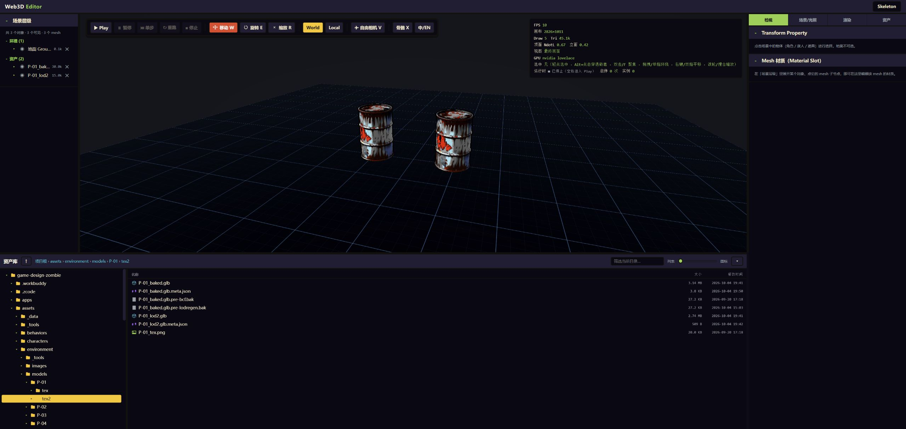

# Environment LOD audit and delivery — 2026-10-04

## Delivered state

Worktree: `game-design-zombie-worktree-01`, branch `fix/lod-regen-20261004`, audit started at `0b77b80`.
The branch replaces the old environment clustering/rebaking route with source-UV-preserving simplification. This delivery completes both LOD1 and LOD2 for all 38 static environment assets; character assets are outside this update.

- LOD1: `assets/environment/models/<ID>/tex2/<ID>_baked.glb`.
- LOD2: `assets/environment/models/<ID>/tex2/<ID>_lod2.glb`.
- Manifest and quality index regenerated; both standalone Asset Browser and editor asset dock expose the textured levels.
- 19 existing prop references in Act 1 floors 1–3 now use the reviewed LOD1 with stable GUIDs and corrected W/D/H collider extents.
- The registered `assets/scenes/sandbox/environment-lod-validation.scene.json` retains the two models placed and saved through the editor. Project startIndex remains 1 (the existing game floor).

## Algorithm and corrections

`build_environment_lods.py` owns generation, staging and guarded publication. It uses exact duplicate welding and texture-aware QEM with boundary preservation. UV seams remain separate render corners. Identical position/UV/normal tuples are compacted losslessly; every triangle corner is checked before publication. Texture layout is retained and encoded through the existing texture helper; this is not a claim of byte-identical texture encoding.

Per-asset `userData.lodBuild` in the LOD1 sidecar owns targets and explicit source rotations. Source placement uses `props.json` footprint `[W,D,H]` as world `[X,Y,Z]=[W,H,D]`, centres X/Z and grounds Y. Both levels share the same source transform and scale; only tiny ground offsets are corrected per level. Normals use the inverse-transpose transform. The GLBs declare Y-up/metres so the engine does not reinterpret deep objects as Z-up.

The handoff's proposed UV-chart count is not a count of planes or disconnected shells, and does not prove a triangle lower bound. The corrected chart utility requires shared geometric edges plus matching UV endpoints. Render-index boundaries also include UV/hard-normal splits, so the editor no longer labels that statistic as proof of broken geometry.

P-05 and P-43 now retain recognizable geometry at both levels. P-43's explicit X rotation is -90 degrees, verified with the wheels at the ground. P-31 needs 20,000 LOD2 triangles: the 15,000 trial exceeded the 5% bounds-drift gate. Original source defects are retained where present; this report does not claim every raw source or delivered mesh is watertight.

`props.json.tris` design budgets were restored after the handoff experiment had replaced them with chart counts. Actual LOD targets and measured triangle counts are recorded separately.

## Numeric acceptance

Every delivered level passed finite position/UV, 90–110% source surface area, at most 5% dimensional drift, 95–105% target triangle count, and no increase in welded boundary/nonmanifold edge counts relative to its source. LOD2 must have fewer triangles than LOD1. Source/config/footprint/output hashes are checked before publishing and by the asset audit.

Across all assets: 18,991,127 source triangles → 1,139,999 LOD1 / 574,999 LOD2 triangles. Minimum surface retention 95.92%; maximum dimensional drift 1.87%. Delivered GLBs total 239.3 MB.

## Visual and scene acceptance

All 38 sources and all 76 delivered levels were inspected in headed Chrome with the NVIDIA GPU. Asset Browser card opening and visible LOD switching were used, with saved contact sheets below. Inspection covered object identity, silhouette, texture, up axis and ground contact. The browser now shows true model bounds and scales its fog range for large environment pieces; automatic up-axis/ground correction no longer hides malformed environment exports.

[Engine import evidence](evidence/environment-lods-2026-10-04/engine-import.json) records all 76 assets passing the actual `parseGlb` and sidecar-height path, matching triangle counts, metre dimensions and ground height. This import probe supplements the screenshots; it is not a substitute for user-path testing.

The visible editor workflow was exercised with P-01 LOD1 and LOD2: asset-dock double-click → Inspector keyboard position edit → undo/redo → Save Scene → reload. The two persisted nodes retain GUIDs, scale 1, X=-0.7/+0.7 and Y=0. Additional insertion undo/redo was tested separately, including recreation of the GPU view and its texture.

This uncovered and fixed two integration failures: imports were ephemeral renderer objects without scene NodeIds, and cached ImageBitmaps were closed before redo. `SpawnEditStore` owns insertion/transform history; `AuthorAssetController` owns the derived view and temporary CPU texture cache; `AuthorSceneSaver` authorizes exact inserted nodes, preserves unrelated fields and retains its snapshot/CAS conflict rules. GPU textures and buffers are released through the existing object-removal owner. CPU texture history is released after a completed save without remaining history or on scene replacement. Capacity failure rolls back the attempted redo.

[Saved scene evidence](evidence/environment-lods-2026-10-04/scene-placement.json)



## Per-asset measurements and screenshots

Surface = LOD1/LOD2 source-area ratios. Drift = maximum X/Y/Z extent drift across both levels. Each screenshot link covers its group of models at both levels.

| Asset | LOD1 triangles | LOD2 triangles | Surface | Max drift | Evidence |
|---|---:|---:|---|---:|---|
| P-01 油桶 | 30,000 | 15,000 | 99.9% / 99.6% | 0.15% | [view](evidence/environment-lods-2026-10-04/01-P-01.jpg) |
| P-02 水泥路障 | 30,000 | 15,000 | 100.0% / 99.8% | 0.07% | [view](evidence/environment-lods-2026-10-04/01-P-01.jpg) |
| P-03 铁皮垃圾桶 | 30,000 | 15,000 | 99.9% / 99.5% | 0.21% | [view](evidence/environment-lods-2026-10-04/01-P-01.jpg) |
| P-04 托盘货箱 | 30,000 | 15,000 | 99.7% / 98.9% | 0.21% | [view](evidence/environment-lods-2026-10-04/02-P-04.jpg) |
| P-05 轮胎堆 | 29,999 | 14,999 | 101.1% / 97.8% | 0.60% | [view](evidence/environment-lods-2026-10-04/02-P-04.jpg) |
| P-06 沙袋掩体 | 30,000 | 15,000 | 99.5% / 98.5% | 0.42% | [view](evidence/environment-lods-2026-10-04/02-P-04.jpg) |
| P-11 翻覆轿车 | 30,000 | 15,000 | 99.7% / 98.6% | 0.15% | [view](evidence/environment-lods-2026-10-04/03-P-11.jpg) |
| P-12 厢式货车残骸 | 30,000 | 15,000 | 99.2% / 97.3% | 0.26% | [view](evidence/environment-lods-2026-10-04/03-P-11.jpg) |
| P-13 公路护栏 | 30,000 | 15,000 | 99.6% / 98.7% | 0.46% | [view](evidence/environment-lods-2026-10-04/03-P-11.jpg) |
| P-14 加油机 | 30,000 | 15,000 | 99.5% / 98.6% | 0.56% | [view](evidence/environment-lods-2026-10-04/04-P-14.jpg) |
| P-15 路边广告牌 | 30,000 | 15,000 | 99.6% / 98.2% | 0.18% | [view](evidence/environment-lods-2026-10-04/04-P-14.jpg) |
| P-16 收费站亭 | 30,000 | 15,000 | 99.2% / 97.7% | 0.15% | [view](evidence/environment-lods-2026-10-04/04-P-14.jpg) |
| S-01 加油站雨棚 | 30,000 | 15,000 | 99.6% / 99.0% | 0.22% | [view](evidence/environment-lods-2026-10-04/05-S-01.jpg) |
| S-02 便利店 | 30,000 | 15,000 | 99.3% / 97.9% | 0.33% | [view](evidence/environment-lods-2026-10-04/05-S-01.jpg) |
| P-21 重型货架 | 30,000 | 15,000 | 99.4% / 98.0% | 0.31% | [view](evidence/environment-lods-2026-10-04/05-S-01.jpg) |
| P-22 冷库门 | 30,000 | 15,000 | 99.9% / 99.5% | 0.35% | [view](evidence/environment-lods-2026-10-04/06-P-22.jpg) |
| P-23 叉车 | 30,000 | 15,000 | 99.0% / 96.8% | 0.16% | [view](evidence/environment-lods-2026-10-04/06-P-22.jpg) |
| P-24 传送带段 | 30,000 | 15,000 | 99.7% / 98.6% | 0.19% | [view](evidence/environment-lods-2026-10-04/06-P-22.jpg) |
| P-25 卷帘门 | 30,000 | 15,000 | 99.5% / 98.7% | 0.51% | [view](evidence/environment-lods-2026-10-04/07-P-25.jpg) |
| P-26 储油罐 | 30,000 | 15,000 | 99.6% / 98.4% | 0.17% | [view](evidence/environment-lods-2026-10-04/07-P-25.jpg) |
| S-03 仓库外壳 | 30,000 | 15,000 | 99.7% / 99.3% | 0.11% | [view](evidence/environment-lods-2026-10-04/07-P-25.jpg) |
| S-04 冷库房 | 30,000 | 15,000 | 99.7% / 98.7% | 0.38% | [view](evidence/environment-lods-2026-10-04/08-S-04.jpg) |
| P-31 铁轨段 | 30,000 | 20,000 | 99.3% / 98.5% | 1.87% | [view](evidence/environment-lods-2026-10-04/08-S-04.jpg) |
| P-32 废弃车厢 | 30,000 | 15,000 | 98.3% / 95.9% | 0.32% | [view](evidence/environment-lods-2026-10-04/08-S-04.jpg) |
| P-33 电缆管线 | 30,000 | 15,000 | 99.6% / 97.7% | 0.23% | [view](evidence/environment-lods-2026-10-04/09-P-33.jpg) |
| P-34 检修平台 | 30,000 | 15,000 | 99.7% / 98.9% | 0.16% | [view](evidence/environment-lods-2026-10-04/09-P-33.jpg) |
| P-35 站台长椅 | 30,000 | 15,000 | 99.6% / 98.5% | 0.43% | [view](evidence/environment-lods-2026-10-04/09-P-33.jpg) |
| P-36 通风管道 | 30,000 | 15,000 | 100.0% / 99.8% | 0.08% | [view](evidence/environment-lods-2026-10-04/10-P-36.jpg) |
| S-05 隧道段模块 | 30,000 | 15,000 | 100.0% / 99.9% | 0.13% | [view](evidence/environment-lods-2026-10-04/10-P-36.jpg) |
| S-06 地铁站台 | 30,000 | 15,000 | 99.3% / 97.9% | 0.24% | [view](evidence/environment-lods-2026-10-04/10-P-36.jpg) |
| P-41 病床 | 30,000 | 15,000 | 99.4% / 97.5% | 0.22% | [view](evidence/environment-lods-2026-10-04/11-P-41.jpg) |
| P-42 输液架 | 30,000 | 15,000 | 99.8% / 98.7% | 0.10% | [view](evidence/environment-lods-2026-10-04/11-P-41.jpg) |
| P-43 轮椅 | 30,000 | 15,000 | 99.1% / 96.1% | 0.20% | [view](evidence/environment-lods-2026-10-04/11-P-41.jpg) |
| P-44 隔断屏风 | 30,000 | 15,000 | 99.8% / 99.5% | 0.13% | [view](evidence/environment-lods-2026-10-04/12-P-44.jpg) |
| P-45 培养舱 | 30,000 | 15,000 | 99.9% / 99.6% | 0.09% | [view](evidence/environment-lods-2026-10-04/12-P-44.jpg) |
| P-46 医疗推车 | 30,000 | 15,000 | 99.6% / 98.8% | 0.13% | [view](evidence/environment-lods-2026-10-04/12-P-44.jpg) |
| S-07 病房模块 | 30,000 | 15,000 | 99.7% / 99.1% | 0.19% | [view](evidence/environment-lods-2026-10-04/13-S-07.jpg) |
| S-08 天台机房与水塔 | 30,000 | 15,000 | 99.4% / 98.0% | 0.18% | [view](evidence/environment-lods-2026-10-04/13-S-07.jpg) |

## Reproduction and checks

Use a Python environment with pymeshlab, numpy and Pillow. On this host it is `C:/Users/fangy/.workbuddy/binaries/python/envs/default/Scripts/python.exe`.

```powershell
$meshPython = 'C:/Users/fangy/.workbuddy/binaries/python/envs/default/Scripts/python.exe'
& $meshPython assets/environment/_tools/build_environment_lods.py --jobs 2
# Inspect staged numeric reports before replacing assets.
& $meshPython assets/environment/_tools/build_environment_lods.py --publish
pnpm run scene:gen
python assets/environment/_tools/audit_lod_quality.py
node assets/_tools/gen_manifest.mjs
# Perform headed Asset Browser review and record visualReview evidence in sidecars.
pnpm run scene:gen
node assets/_tools/gen_manifest.mjs
pnpm run scene:check
```

A fresh build sets visualReview to pending. Do not copy this run's reviewed status onto changed GLBs. `regen_env_lods.py` forwards to this pipeline; old single-level invocations must be updated to the documented arguments.

Validation completed: focused Python regression tests (placement, UV connectivity, attribute-exact compaction, incomplete/tampered publication); scene/document/GLB/manifest/import tests; author insertion/transform/save/history tests; TypeScript typecheck; scene:check; editor production build. Individual check results and browser evidence are retained with this delivery.

## Boundaries and follow-up

This is a geometry/texture/placement and authoring-persistence acceptance, not mobile performance acceptance. Current targets are 30k LOD1 and 15k LOD2 (P-31 20k), with native-resolution textures. The older small mobile triangle budgets are not met. No automatic distance-based runtime LOD selector, texture streaming, exhaustive collision/playthrough acceptance or mobile frame-time profiling was added. Fine source-art defects remain candidates for asset-specific art repair.

The validation editor service was started detached from this worktree on port 5100; logs are `.workbuddy/tmp/lod-audit/editor.stdout.log` and `.stderr.log`. At delivery its owned PID was 69956 (`Stop-Process -Id 69956` only after rechecking ownership). The existing Asset Browser service on port 5612 was reused.
