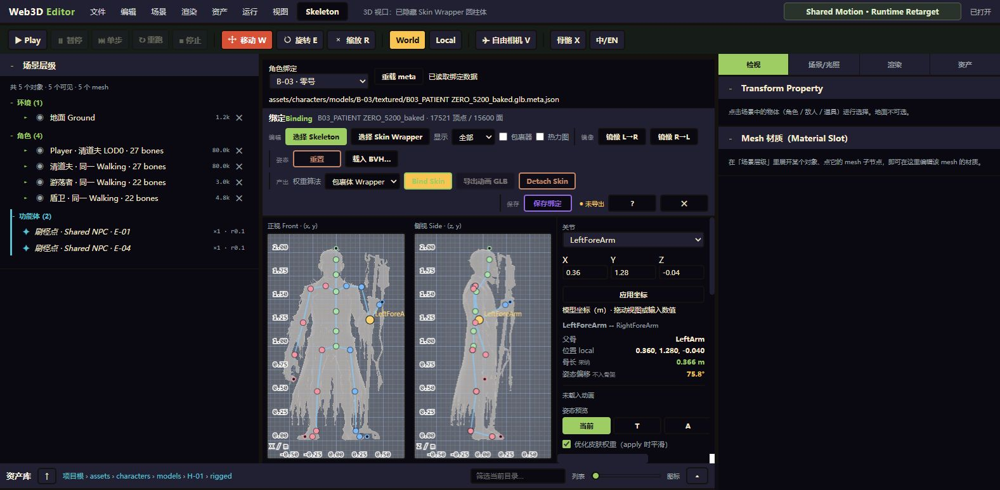

# Character binding workspace

Open **Skeleton → 角色绑定数据…** in the Game Editor. The character picker uses the existing asset manifest; player entries use LOD0 and NPC entries prefer their textured source mesh. The displayed path identifies the sidecar being edited.

Choose a joint in **骨骼关节**, drag it in the front/side views, or enter model-space XYZ coordinates in metres and click **应用坐标**. The front view edits X/Y; the side view edits Z/Y. Coordinate edits use the existing binding session and undo history. Numeric editing is available in the current pose, not the derived T/A previews.

**保存绑定** persists the current `bindingEditor` to `<source>.glb.meta.json` through the existing version-checked persistence service. **重载 meta** reads it back. Switching, reloading, or closing a dirty binding asks before discarding changes. Loads superseded by another load/close are ignored; edits made during loading are retained. Each character starts with its own session, so absent metadata cannot inherit the preceding character's joint positions.

The E-02, E-03, E-04, E-05, B-01 and B-03 sidecars now contain editable source-pose drafts from the NPC fitting review. Their joint anatomy still needs review. Existing E-01 and H-01 bindings are retained. Saving metadata does not export a rig or replace an existing rigged GLB; wrapper fitting, smooth skin and animation validation remain later steps.

## Verification, 2026-10-06

- Headed Chrome: opened the workspace through the Skeleton menu; changed E-04 LeftForeArm Y from 1.28 to 1.285, saved, reloaded and confirmed 1.285, then restored and saved 1.28.
- Cancelled the unsaved-change dialog and confirmed the old E-04 source and edited joint remained. The guard was triggered through the supported editor automation hook to avoid a synchronous native dialog blocking locator evaluation.
- Switched through the actual character picker to E-03 and B-03 and confirmed their own LeftForeArm positions: `[0.43, 1.06, -0.07]` and `[0.36, 1.28, -0.04]`.
- Existing binding session/persistence tests, typecheck, editor build and scene metadata gate were run. This verifies the metadata authoring flow, not final skin quality.
- The GUI patch writer now emits the same trailing LF as the sidecar generator and MCP writer; a filesystem regression check covers this format so saving from the UI does not fail the metadata gate.
- Filesystem checks passed with `pnpm exec vite-node tools/verify/devfs-write.mjs`. The existing `pnpm run verify:fs` entry fails on an extensionless TypeScript import under Node's strip-types loader; the Vite resolver runs the same suite successfully.

